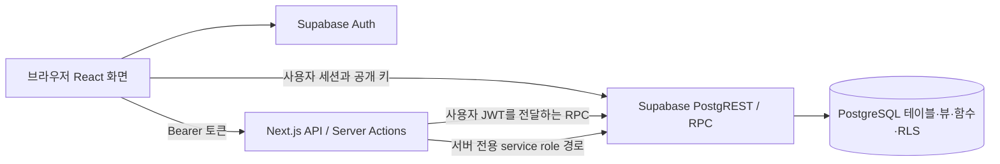

# 지방소멸대응기금 시스템 보안·성능 점검 안내

작성 기준: 2026-09-23 로컬 소스. 이 문서는 타부서 코드 점검용이며 DB 변경, 계정 생성, 운영전환, 배포를 승인하지 않는다. 실제 점검 계정·비밀번호·키·DB 연결 문자열은 포함하지 않는다.

**전달 방식: 현재 소스의 가명처리 사본을 담은 독립 점검 커밋.** 로컬 원본과 과거 이력은 보존하고, 비밀번호·업무자료가 포함된 과거 커밋은 전달하지 않는다. 기능과 DB 정의를 점검할 코드는 보존하며, 실제 계정·프로젝트 참조·시험 거래 식별자 등 환경에 종속된 값만 예시 값으로 대체했다. 파일 목록과 재현 검증 결과는 [점검 범위](SECURITY_PERFORMANCE_REVIEW_COVERAGE.md), 실제 전달 상태는 [작업 결과](SECURITY_PERFORMANCE_REVIEW_STATUS.md)를 참고한다.

## 1. 목적과 사용자 기능

지방소멸대응기금 사업의 분류·예산·집행·사업간 예산조정·확인요청·통계를 관리하는 Next.js 애플리케이션이다.

| 사용자 | 주요 기능 | 코드 위치 |
|---|---|---|
| 지자체 담당자 | 담당 지역 사업 목록, 사업정보·분류 수정, 신규사업 초안, 재원 연결, 집행, 예산조정, 확인요청 회신 | `app/my-projects/`, `components/my-projects/` |
| 관리자 | 전체 현황·사업 검토, 재정처리 이력, 확인요청 작성·완료, 소분류 제안 검토, 계정 생성 | `app/admin/`, `components/admin/`, `app/confirmations/`, `app/api/admin/generate-accounts/route.ts` |
| 공통 | 로그인·비밀번호 변경, 통계 필터·CSV, 대시보드 | `app/page.tsx`, `app/password-reset/`, `app/api/analytics/`, `components/dashboard/`, `components/analytics/` |

메뉴 구성은 `lib/appNavigation.ts`와 `components/common/RightSidebarNavigation.tsx`에 있다. 메뉴 숨김만으로 권한을 보장한다고 판단하지 말고 서버와 DB 검증까지 확인한다.

## 2. 연결 구조



- 프런트엔드/서버: Next.js App Router, React, TypeScript. 실제 설치 버전은 루트 `package-lock.json`으로 고정한다. 테스트 실행기는 별도 `test-automation/package-lock.json`을 사용한다.
- 브라우저 클라이언트: `lib/supabaseClient.ts`. 사용자 세션으로 조회·수정하며 일부 흐름은 브라우저에서 직접 RPC를 호출한다.
- 사용자 권한을 유지하는 서버 처리: `app/my-projects/*-actions.ts`, `app/confirmations/actions.ts`, `app/admin/ledger-cutover/actions.ts`. 전달된 JWT로 DB가 `auth.uid()`를 판정한다.
- 서버 관리자 클라이언트: `lib/supabaseAdmin.ts`. API 토큰 확인과 프로필 조회 후 사용하는 조회·계정관리 경로가 있다. service role은 RLS를 우회할 수 있으므로 지역 제한과 역할 검증 누락 여부를 각 호출 지점에서 점검한다.
- Vercel 프로젝트 연결 파일은 로컬에만 보존한다. 서비스 URL·Auth·DB에는 접속하지 않았으며, GitHub와 Vercel의 관리 설정만 읽기 전용으로 확인했다.

## 3. 현행 업무 처리와 과거 승인 방식

아래는 현재 화면·Server Action·최신 SQL 정의에 근거한 흐름이다. 실제 TEST DB에 해당 SQL과 설정이 모두 반영되었는지는 이번 작업에서 확인하지 않았다.

1. **신규사업 초안:** 재원 없이도 임시저장할 수 있다. 초안 상태와 공식 사업·공식 금액은 구분한다. `NewProjectRequestPanel.tsx`, `NewProjectRequestFields.tsx`, `funding-actions.ts`를 함께 본다.
2. **등록·예산연결:** 현행 표준 흐름은 필수정보와 재원을 검증한 뒤 하나의 처리 트랜잭션에서 등록·연결을 완료하는 방식이다. `financial_submit_new_project_request_v2`, `financial_complete_new_project_request` 및 예정재원 연결 RPC가 핵심이다.
3. **예산조정:** 출처 감액과 기존·차년도 신규 목적지 배분을 하나의 요청으로 처리한다. 다중 목적지, 합계 보존, 지역·연도 제한, 미완료 요청액, 중복 제출·재시도, 동시성 처리를 점검한다. `budget-change-actions.ts`, `lib/budgetChanges.ts`, `ProjectFundingManagementSection.tsx`가 진입점이다.
4. **집행:** `financial-actions.ts`와 재정원장 RPC가 금액·효력일·재원 잔액·멱등키 등을 확인한다. 집행 취소/반대거래 정의는 `20260915000100_execution_reversal_origin_and_grant.sql`도 참고한다.
5. **사후 확인요청:** 관리자가 확인요청을 만들고 지자체가 회신한 뒤 관리자가 완료한다. 알림 읽음과 업무 완료는 별개이며, 이 흐름 자체가 재정금액을 승인·증감시키는 것은 아니다. `app/confirmations/actions.ts`, `lib/postChecks.ts`, `ConfirmationCenterShell.tsx`를 본다.
6. **분류·사업변경:** 사업명/분류 변경 이력, 유사 사업 관계, 소분류 제안은 별도 모델이다. 소분류 제안의 관리자 승인·매핑은 남아 있으므로 모든 승인 기능이 제거되었다고 해석하지 않는다.
7. **삭제:** 신규사업·초안 삭제는 적격성 검사와 소프트 삭제를 사용한다. 참조·거래가 있는 사업 처리, 제외된 사업의 목록·통계·확인요청 처리 일관성을 점검한다.

주요 근거:

- `supabase/migrations/20260907000100_multi_destination_budget_change.sql`
- `supabase/migrations/20260911000100_budget_change_auto_apply_and_destination_correction.sql`
- `supabase/migrations/20260914000200_direct_new_project_and_post_checks.sql`
- `supabase/migrations/20260914000300_direct_new_project_existing_validation_hotfix.sql`
- `supabase/migrations/20260914000400_direct_grouped_destination_trace_hotfix.sql`
- `supabase/migrations/20260914000500_new_project_soft_delete.sql` 이후 삭제 보완 정의

직접 처리 SQL은 `financial_direct_workflow_settings`와 `processing_mode`를 도입하고 과거 승인 이력을 보존한다. 이전 승인 RPC의 호출 권한 제한과 최신 함수 재정의를 함께 읽어야 한다. `funding-actions.ts`에는 과거 재배분·정정 관련 RPC도 남아 있다. 오래된 UAT의 “관리자 승인 후 적용” 설명을 현재 신규사업·예산연결의 공통 절차로 사용하지 않는다. `test-automation`의 일부 시나리오도 과거 승인 절차를 포함하므로 실행 전 최신 흐름과 대조한다.

## 4. 로컬 점검 준비

### 실행 조건과 제한

- 이번 작업에서 사용 가능한 Node는 24.19.0이다. 단위 검사는 `--experimental-strip-types`를 쓰므로 이 옵션을 지원하는 Node 환경을 준비한다.
- 두 개의 npm 잠금 파일을 보존한다. 서비스 의존성은 루트, 브라우저 점검 의존성은 `test-automation`에 설치한다.
- `lib/testLoginAliases.ts`와 관련 계정 생성·시험 코드는 삭제하지 않고 가명처리하여 포함했다. 별칭의 예시 값은 `review_user_1`부터 `review_user_5`, 이메일은 `example.invalid` 도메인이다. 이 값으로 기존 TEST 계정에 로그인할 수 없다. 실제 TEST 이메일 로그인 또는 승인된 별칭 설정은 별도 인수한다.
- 코드·SQL의 TEST/PROD 참조를 `reviewtestxxxxxxxxxx`/`reviewprodxxxxxxxxxx`로 치환했다. `.env.review.example`과 함께 실제 TEST 대상에 맞춰 점검용 설정을 준비해야 한다. 이 가상 참조는 접속 주소가 아니며 TEST 차단 조건을 끄거나 Production 참조로 대체하지 않는다.
- 특정 실행 기록을 재조회하는 UAT의 UUID와 거래금액 일부는 합성 예시로 대체했다. 해당 UAT는 별도 TEST fixture 준비 후 실행하며, 현재 DB에 그 행이 있다고 가정하지 않는다. 가명처리 목록은 점검 범위 문서에 있다.
- 보안·성능 점검에서는 `seed`, `import:*`, 계정 생성, 마이그레이션 실행기, UAT 변경 시나리오를 임의 실행하지 않는다. 일부 스크립트는 실제 DB/Auth/서버 설정을 변경한다.

### DB에 연결하지 않는 화면 확인

기존 개인 `.env.local`을 덮어쓰지 말고 격리된 점검 작업 폴더에서 다음을 수행한다.

```powershell
npm ci
Copy-Item .env.demo.example .env.local
npm run dev
```

`NEXT_PUBLIC_DEMO_MODE=true`이면 `/demo`와 `/demo/analytics`의 합성 자료를 사용한다. `middleware.ts`가 실데이터 API 및 변경 요청을 거부하고 `lib/demo-mode.ts`와 Supabase 클라이언트 초기화가 공개 데모 경계를 설정한다. 데모 확인은 실제 인증·RLS·서버 성능 검증을 대신하지 않는다.

### 승인된 TEST 환경 확인

1. `.env.review.example`을 참고해 실제 TEST 설정을 별도 안전 채널로 받는다. 저장소에 실제 값을 기록하지 않는다.
2. 서비스에는 `.env.local`, 스크립트에는 `.env.ledger-test.local`, 계정은 `.env.ledger-uat-credentials.local`을 로컬에만 둔다. 스크립트마다 읽는 파일과 인수가 다르므로 소스를 확인한다.
3. `TARGET_ENV`, URL의 프로젝트 참조, `TEST_PROJECT_REF`, `PROD_PROJECT_REF`가 올바르게 구분되는지 확인한다. Production 키·URL을 시험용으로 재사용하지 않는다.
4. 예시의 `LEDGER_MODE=disabled`는 일부 원장 변경 경로를 막지만, 모든 메타데이터·확인요청 쓰기를 일괄 차단하는 읽기 전용 모드가 아니다. 조회 전용 점검에는 실제 권한·행동 제한도 필요하다.
5. 서버를 실행한 뒤 조회 전용 화면/API부터 확인한다. DB 변경 검증은 별도로 승인된 TEST 계획에서만 진행한다.

### 코드 검사 명령

```powershell
npm run test:presentation
npm run test:unit
npm run lint
```

`npm run build`에는 `prebuild` 표시 회귀 검사가 연결되어 있다. 이번 파일 선별 작업에서는 전체 UAT·DB 감사·장시간 빌드를 반복하지 않았다. 앞선 한글 표시 수정 작업에서는 표시 검사 17개와 빌드가 통과했고 전체 단위 검사 239개 중 2개는 기존 UI 구조에 대한 기대값 차이로 실패했다. 해당 결과는 현재 작업의 재실행 결과가 아니며, 실패 위치는 `passwordChangeContract.test.ts`와 `budgetChangeWorkflowContract.test.ts`이다.

브라우저 점검 코드는 `test-automation/runner.mjs`, `suite.mjs`, `package.json`에 있다. 설치 시에는 `npm --prefix test-automation ci`를 사용한다. TEST 호스트와 계정·역할·지역·실행 모드에 대한 고정 조건이 있어 다른 환경에서 그대로 동작한다고 보장하지 않는다. `build-clean-test-preview.cjs` 및 `start-clean-test-preview.cjs`는 기본적으로 제외된 로컬 worktree를 참조한다. 독립 점검 복제본에서는 해당 경로를 전제로 하지 말고 루트 실행 절차를 사용한다.

## 5. 환경변수 목록

| 이름 | 용도·취급 |
|---|---|
| `NEXT_PUBLIC_SUPABASE_URL` | 브라우저와 서버가 연결할 승인된 TEST Supabase URL |
| `NEXT_PUBLIC_SUPABASE_ANON_KEY` | 브라우저에 공개되는 프로젝트 키. 사용자 JWT/RLS와 함께 사용하며 service role을 넣지 않는다 |
| `SUPABASE_SERVICE_ROLE_KEY` | 서버 전용 관리자 클라이언트 키. 브라우저 번들·로그·문서에 포함 금지 |
| `NEXT_PUBLIC_DEMO_MODE` | 공개 합성 데모 모드. 환경을 바꾸면 개발 서버 재시작/재빌드 필요 |
| `NEXT_PUBLIC_FINANCIAL_LEDGER_UI` | 재정원장 관련 화면 노출. 권한 검증의 대체 수단이 아님 |
| `TARGET_ENV` | 원장 TEST 대상 검증. TEST 작업에서는 `TEST` |
| `TEST_PROJECT_REF` | TEST URL/DB가 일치하는지 확인할 참조 |
| `PROD_PROJECT_REF` | TEST와 같지 않은지 비교하는 차단용 참조. Production 접속을 위한 값이 아님 |
| `LEDGER_MODE` | 일부 원장 쓰기 보호. 승인된 쓰기 검증에서만 `test` 조건을 검토 |
| `TEST_SUPABASE_SERVICE_ROLE_KEY` | TEST 전용 관리·감사 스크립트가 사용하는 서버 키 |
| `TEST_DATABASE_URL` | 별도 승인된 TEST SQL 검사/실행기의 연결 문자열. 문서나 GitHub에 실제 값 기록 금지 |
| `UAT_ADMIN_A_EMAIL`, `UAT_ADMIN_B_EMAIL` 및 대응 `_PASSWORD` | 관리자 역할 시험용 환경변수 이름. 실제 계정은 별도 전달 |
| `UAT_LOCAL_A_EMAIL`, `UAT_LOCAL_B_EMAIL`, `UAT_LOCAL_C_EMAIL` 및 대응 `_PASSWORD` | 지역별 격리 검증용 환경변수 이름. 실제 계정은 별도 전달 |

`.env.example`, `.env.demo.example`, `.env.review.example`에는 자리표시자 또는 데모용 비밀값 없는 설정만 둔다. 실제 대상에 고정된 참조/계정 별칭을 갖는 코드가 있으므로 환경변수만 채우면 완전히 이식된다고 가정하지 않는다.

## 6. DB·RLS·인증 점검 위치

| 영역 | 주요 정의와 확인 내용 |
|---|---|
| 기본 업무 | `regions`, `profiles`, `projects`, `audit_logs`: 지역, 역할, 사업 금액과 감사 |
| 사업 분류 | 대·중·소분류 및 사업-소분류 관계, 사용자 제안: `20260818_13`~`15`와 관련 마이그레이션 |
| 원장 | `project_budget_cohorts`, `project_budget_years`, `project_fund_transfers`, `project_execution_records`, `project_carryovers`, `project_budget_adjustments`: 원재원·연도·거래·집행 |
| 기준선·운영전환 | `financial_ledger_cutovers`, `project_financial_baselines`, `project_baseline_corrections`, `project_metadata_history` 및 런타임 경계 |
| 재배분·신규사업 | `financial_unallocated_fund_lots`, `financial_unallocated_fund_movements`, `financial_new_project_requests`, 재배분·감액 분류 |
| 예산조정 | `financial_budget_change_requests`, 요청 라인, 예정재원·연결 요청: 원금 보존과 목적지 정합성 |
| 확인요청 | `financial_post_check_requests`, `system_notifications`: 역할·지역별 조회/회신/완료 범위 |
| 통합 조회 | `financial_project_funding_positions` 등 집계 뷰/RPC: 원장 적용 사업과 기존 사업의 표시 일관성 |

- 기본 스키마: `db/schema.sql`, `db/rls.sql`, `supabase/schema.sql`, `supabase/rls.sql`.
- 추가 정의: `supabase/202608*.sql`, `supabase/migrations/*.sql`.
- 정적 사전검사/실험 SQL: `supabase/preflight_*.sql`, `supabase/drafts/`.
- 로그인·프로필·비밀번호: `lib/auth.ts`, `lib/password.ts`, `app/password-reset/page.tsx`.
- 관리자 API: `app/api/admin/generate-accounts/route.ts`, `app/api/admin/project-changes/export/route.ts`.
- DB 함수에서는 `SECURITY DEFINER`, `search_path`, `auth.uid()`, 역할·지역 검사, `GRANT/REVOKE EXECUTE`, 트리거 우회 가능성, 금액 불변조건과 롤백 범위를 함께 검토한다.
- 브라우저 세션에서 요청한 `region_id`를 그대로 신뢰하는지, service role 조회가 서버에서 지역 범위를 강제하는지, 오류·내보내기에 계정/내부 정보가 노출되는지 점검한다.

**정의와 실제 DB의 차이:** `db/schema.sql`과 `supabase/schema.sql`은 지역 식별자 타입부터 서로 다른 초기 설계를 포함한다. 초기 seed도 현재 스키마 전체를 재현하지 않는다. 모든 SQL 파일을 순서 없이 일괄 실행해서는 안 된다. 최신 SQL에는 기존 데이터 보정·권한 변경과 설치 전제조건도 있다. 이번 작업은 SQL 문서를 읽고 분류했으며 실행하지 않았다. 실제 TEST 카탈로그, 적용 마이그레이션, 역할 권한, 함수 본문, 인덱스와 일치하는지는 **미확인**이다.

SQL의 `INSERT INTO projects`가 모두 DB 덤프인 것은 아니다. 함수 내부의 입력값 기반 업무 처리와 A/B/C 가상 지역을 쓰는 합성 seed는 코드로 보존한다. 실제 프로젝트 행을 담은 JSON·HTML·백업은 제외한다.

## 7. 느린 화면·API 조사 지점

**응답시간, 처리량, p50/p95/p99, 실제 DB 실행계획은 모두 미측정이다.** 아래 항목은 정적 코드로 식별한 조사 지점이며 성능의 우수/불량 판정이 아니다.

| 화면/기능 | 위치 | 조사할 내용 |
|---|---|---|
| 대시보드 KPI | `app/api/projects/summary/route.ts`, `OverviewPanel.tsx` | 정확 건수 계산, 페이지별 병렬 조회 수, 원장 집계 뷰 비용, 서버리스 시작 지연과 응답 크기 |
| 내 사업 목록 | `app/my-projects/workspace-actions.ts`, `MyProjectsWorkspace.tsx` | 사업·분류·요청·원장 위치 동시 조회, 지역 조건의 DB 전달, 가져오는 행 수와 화면 페이지 수 차이 |
| 사업 상세 | `MyProjectEditShell.tsx`, `lib/myProjects.ts`, `lib/projectReview.ts` | 상세·분류·삭제 적격성·유사사업 등 초기 요청 수, 반복 렌더링과 중복 요청 |
| 통계/CSV | `app/api/analytics/route.ts`, `lib/analytics/queries.ts`, `lib/fundingAnalytics.ts` | 1,000행 단위 원자료 순회, 서버 메모리 집계, 분류 관계 조회, 여러 통계의 병렬 호출, CSV 전체 행 출력 |
| PostgREST 필터 | `lib/postgrest.ts` | `in(...)` 목록 분할 크기 200, URL 길이와 분할 요청 수 |
| 검색 | `budget-change-actions.ts`, `lib/presentationLabels.ts` | 한글 표시명/원문 검색 대체 경로가 만드는 추가 RPC 수 |
| 원장 변경 | `financial-actions.ts`, 예산조정 SQL | 잠금 대기, 트랜잭션 길이, 멱등 처리·재시도, 권한 검사 쿼리 및 인덱스 |
| 확인요청 | `app/confirmations/actions.ts`, `ConfirmationCenterShell.tsx` | 목록/알림 조회 수, 미확인 건수 계산, 읽음과 업무 상태 갱신의 반복 호출 |

`supabaseClient.ts`·`supabaseAdmin.ts`와 API의 `no-store` 정책은 최신 값 유지 목적이다. 캐시를 켜는 조치를 이번 작업에서 수행하지 않았다. 성능 점검에서는 지역별/관리자별 데이터 규모, 서버 처리시간과 네트워크 왕복, 브라우저 렌더 시간을 구분하고 TEST에서만 측정한다. `EXPLAIN ANALYZE`는 SQL을 실행하므로 변경문에 임의 적용하지 않는다.

통계의 기준일 처리도 확인한다. `lib/analytics/sourcePolicy.ts`는 현재값 조회와 과거값 재구성을 구분하고, 제공되지 않는 과거 원장 재구성은 현재값으로 대신하지 않는다.

## 8. 코드만으로 확인할 수 있는 것과 별도 접근이 필요한 것

| 코드/정적 설정으로 확인 가능 | TEST·관리 설정 접근이 있어야 확인 가능 |
|---|---|
| 라우트와 호출 구조, 입력 검증, 공개/서버 환경변수 구분 | 실제 로그인·역할·지역별 격리 및 만료 토큰 처리 |
| SQL에 정의된 RLS·권한·트랜잭션·인덱스 | 실제 적용된 RLS/함수/GRANT/인덱스, 스키마 편차 |
| 원장/직접 처리/확인요청의 구현 의도 | `financial_direct_workflow_settings`와 런타임의 실제 값 |
| 조회 페이지 크기·필터 분할·캐시 정책·집계 코드 | 지연시간·동시부하·실행계획·DB 잠금·서버리스 자원 사용 |
| 의존성 잠금 파일과 명시된 테스트 | 설치 환경의 취약점 영향, 서버 환경변수·배포된 소스 SHA |
| 로컬 `.github/workflows` 유무와 npm lifecycle | 원격 Actions, 웹훅, GitHub App, Vercel/Netlify 자동 배포 설정 |

별도 전달 요청 항목: 승인된 TEST URL과 데이터 사용 범위, 역할·지역별 시험 계정, 필요한 최소권한 키, TEST DB 정의 조회 권한, 민감정보를 가린 서버 로그/실행계획, 저장소·배포 관리 설정 조회 권한. 실제 값은 이 문서·GitHub issue·소스에 넣지 않는다.

## 9. 포함·제외 원칙과 재현 한계

- 포함 후보: `app`, `components`, `lib`, `types`, 루트 설정·잠금 파일, 재현용 `scripts`·`tests`·`test-automation` 코드, DB/마이그레이션 정의, 설계 문서, 환경변수 예시.
- 합성 데이터: `lib/demo/data.ts`의 가상 지역/사업과 `db/seed.sql`, `supabase/seed.sql`의 예시 행을 보존한다. seed는 현재 TEST DB 복제본이 아니며 실행을 승인하지 않는다.
- 실제 사업자료: `data/fund_projects_raw.json`의 3,895개 행, `data/source_dashboard.html`의 내장 자료, 검증/대사 산출물 5개는 내용을 확인하고 개별 제외했다. 서비스 화면은 DB를 조회하며 해당 파일은 가져오기·대사 도구의 입력/출력이다. 제외 후 데이터 가져오기 도구는 원자료 없이는 실행할 수 없다.
- 의존성/빌드/분석: `node_modules`, `.next`, `.vercel`, `.codex-tmp`, `graphify-out`, 로그·캐시는 로컬에 보존하고 업로드에서 제외한다.
- 시험/추출 결과: `test-results`의 DB 스냅샷·영상·화면 캡처·중복 소스 단계, `artifacts`, `exports`, `reports`의 생성 결과를 제외한다. 필요한 실행 코드는 `scripts`, `tests`, `test-automation`에 남기며, 로컬 worktree 전용 보조기는 복제하지 않는다.
- `docs/direct-workflow-rollout-rollback-20260914.md`는 실제 처리 식별자·금액을 담은 실행 기록이므로 제외한다. 업무 흐름과 SQL 근거는 이 안내서에 비밀값 없이 정리했다.
- 계정자료: 실제 환경 파일은 제외했다. 계정 생성 스크립트 2개, 계정 관련 감사 스크립트·단위검사, `supabase/README.md`는 비밀값을 자리표시자로 대체한 사본을 포함한다. 고정 비밀번호를 쓰는 레거시 코드의 구조도 보안 검토 대상이므로 임의 개선하지 않았다. 자리표시자를 실제 비밀번호처럼 사용하지 않는다.
- 제외한 파일은 기존 로컬 커밋에 남아 있다. 사용자의 허용에 따라 과거 커밋을 부모로 갖지 않는 독립 점검 커밋으로 전달한다. 기존 이력 재작성·강제 push·자격증명 폐기는 하지 않는다.

## 10. 자동 실행과 전달 전 확인

현재 로컬에는 `.github/workflows`가 없고 루트 npm 설치 lifecycle에 DB 마이그레이션/배포를 자동 실행하는 명령은 없다. `prebuild`는 표시 회귀 검사다. 이것만으로 원격 push의 안전성이 입증되지는 않는다. GitHub App·웹훅·Vercel 프로젝트 관리 설정이 Preview 브랜치에도 자동 실행을 걸 수 있다.

2026-09-23 로컬 Git 인증으로 지정 저장소의 private 상태와 쓰기·관리 권한을 확인했다. 업로드 전 원격 refs·워크플로·저장소 웹훅·배포 기록은 비어 있고 Actions는 활성화 상태다. GitHub App API는 403이었으나 로그인된 GitHub 관리 화면에서 설치 앱이 Vercel인 것을 확인했다. Vercel의 Regional Budget Mngt 팀에 표시된 `declinefund-test-server`와 `declinefund-demo`는 Git 설정에서 모두 저장소 미연결이며 Deploy Hook도 설정할 수 없는 상태로 확인됐다. Netlify 앱·저장소 웹훅·로컬 설정은 발견되지 않았다. 현재 확인한 연결에서는 이 저장소 push로 자동 배포·DB 마이그레이션을 시작하는 경로가 없다. 이후 연결이나 설정이 바뀌면 다시 확인해야 한다.

점검 브랜치는 `review/security-performance-20260923`이다. 기존 로컬 브랜치·기록과 기본 브랜치 이름 `main`에는 push하지 않는다. 수동 배포·별칭 갱신·PR 병합·DB 변경은 수행하지 않는다.

## 11. 이번 전달에서 확인한 재현 범위

TypeScript 타입 검사와 계정 별칭 단위검사 3개를 통과했다. 기존 전체 단위검사는 239개 중 237개 통과, 2개 실패다. 실패는 `passwordChangeContract.test.ts`의 헤더 비밀번호 변경 경로 검사와 `budgetChangeWorkflowContract.test.ts`의 처리 이력 화면 문자열 검사로, 가명처리 전부터 확인된 실패와 동일하다. 기능 변경 금지 범위에 따라 수정하거나 테스트를 제거하지 않았다. 모든 검사가 통과했다고 해석하지 않는다.

이 전달본으로 소스·인증 로직·RLS/권한 정의·조회/집계 구현·의존성을 검토할 수 있다. **현재 TEST DB에 적용된 실제 정의, 계정별 RLS 동작, 실데이터 규모에서의 응답시간까지 검증됐다는 뜻은 아니다.** 이를 위해 지원부서에는 별도 TEST 계정·읽기 전용 DB 메타데이터 조회 권한·가린 서버 로그와 필요한 합성 부하자료를 제공해야 한다. 응답시간은 미측정이다.
